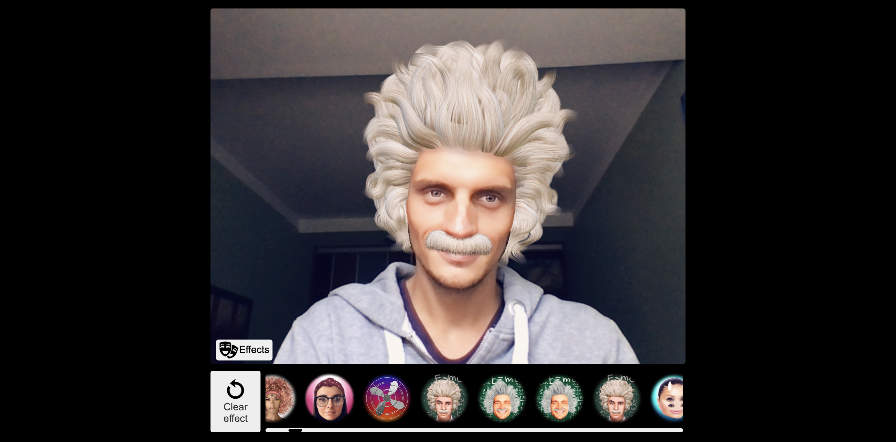

# Banuba AR cloud web sample



AR cloud is a Banuba product, which helps you to optimize traffic usage. It stores AR masks on a web server. This is a sample web app, which gives an idea of how to implement masks storage in your app.
The sample identify masks caching for users, so that he does not need to download them each time he opens the app.

## Requirements

- The [latest](#obtaining-banuba-sdk-web-ar) Banuba SDK Web AR release
- Banuba client token (contact sales@banuba.com if you don’t have one)
- AR cloud urlId  
- [Nodejs](https://nodejs.org/en/) version 14 or later 
- Browser with support of [WebGL 2.0](https://caniuse.com/#feat=webgl2) (Firefox, Chrome, Edge, safari 15) 

### Obtaining AR cloud urlId

`urlId` defines the id of your repository, where the effects are stored on Banuba server

If you don’t have an urlId yet, contact our support here (https://docs.banuba.com/face-ar-sdk/support)

## Environment setup and local run

Clone the repository

Put Banuba SDK Web AR [files](#obtaining-banuba-sdk-web-ar) into "static" folder

```diff
arcloud-web/
    public
    src
    static/
    +  BanubaSDK.data
    +  BanubaSDK.js
    +  BanubaSDK.wasm
    +  BanubaSDK.simd.wasm
    ...
```

Insert Banuba [client token](#obtaining-banuba-client-token) into `src/BanubaClientToken.js`

```js
BANUBA_CLIENT_TOKEN = "PUT YOUR CLIENT TOKEN HERE"
```

## How to use

### Install

> npm install

installing all dependencies

### Run

> npm start

Runs the app in the development mode.
Open http://localhost:8080 to view it in the browser.

The page will reload if you make edits.

### Build

> npm run build

Builds a static copy of your site to the `build/` folder.
Your app is ready to be deployed!

## Using AR cloud in your personal projects

copy `ar-cloud.js` file in project

import `banubaARCloud` and initialize alongside `BanubaSDK`

```js
  import { Player, Effect } from '../static/BanubaSDK.js'
  import banubaARCloud from './ar-cloud'
  import { BANUBA_CLIENT_TOKEN } from './BanubaClientToken.js'

  //...

  const player = await Player.create({ // create player instance
    clientToken: BANUBA_CLIENT_TOKEN,
  })

  await banubaARCloud({
    urlId: 'YOUR URL ID',      // ID of your repository on Banuba server
    player: player,           // playr - instance of Player class from BanubaSDK.js 
    effectClass: Effect,      // Effect - class from BanubaSDK.js
    container: 'carousel',    // HTMLElement where effect previews will be loaded
})
```

